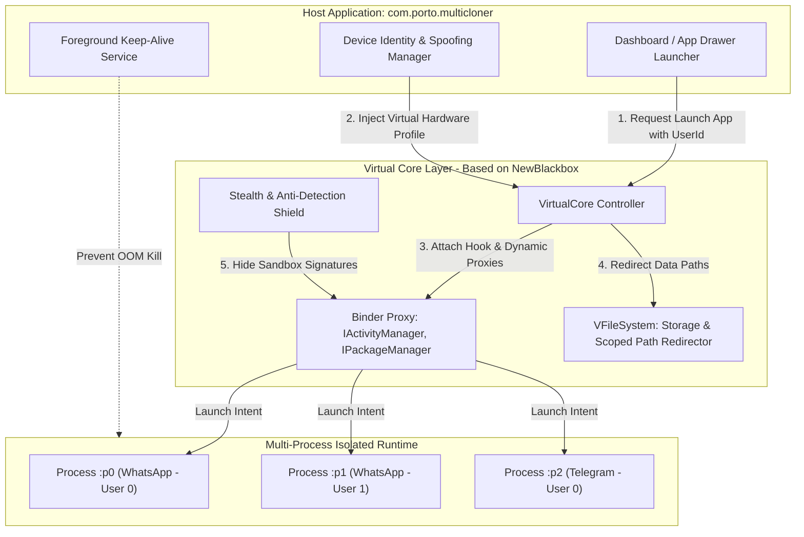

# 🏛️ Architecture Blueprint: Multi-Cloner (V-Space)

> **Document Version**: 1.0.0  
> **System Architecture**: User-Space Virtualization Engine & Identity Spoofing Layer  
> **Target Platform**: Android (Android 7.0 - 15+, ARM64 & ARMv7)

---

## 1. High-Level System Architecture Flow



---

## 2. Component & Code Map Table

| Modul / Komponen | File Target Utama | Tanggung Jawab & Implementasi |
| :--- | :--- | :--- |
| **Application Lifecycle** | `app/src/main/java/.../ClonerApp.kt` | Inisialisasi `VirtualCore.get().doStartup()`, registrasi lifecycle listener, konfigurasi proses daemon. |
| **Virtual Core Controller** | `core/src/main/java/.../virtual/VirtualCore.kt` | Interface jembatan antara UI launcher dengan C++ native engine untuk install virtual app, uninstall, dan launching. |
| **Binder Hooking Engine** | `core/src/main/cpp/vcore_hook.cpp` & `.../proxy/` | Men-intercept panggilan IPC `android.os.IBinder`, memodifikasi respons `ActivityManagerService` dan `PackageManagerService`. |
| **Storage Redirector** | `core/src/main/java/.../storage/VFileSystem.kt` | Memetakan path `/data/data/<pkg>` ke folder sandbox private per-user (`/data/user/<uid>/<pkg>`). |
| **Device ID Spoofer** | `core/src/main/java/.../spoof/DeviceSpoofManager.kt` | Menyediakan konfigurasi unik per user space: `Settings.Secure.ANDROID_ID`, IMEI dummy, Build Serial, MAC address. |
| **Anti-Detection Shield** | `core/src/main/java/.../anti/AntiDetectionHook.kt` | Memalsukan status `/proc/self/maps`, menyembunyikan Xposed/Frida string, dan bypass deteksi `isTestDevice`. |
| **UI Dashboard & Grid** | `app/src/main/java/.../ui/MainActivity.kt` | Menampilkan icon aplikasi yang sudah dikloning, badge status, tombol tambah klon, dan shortcut launching. |
| **App Selector Modal** | `app/src/main/java/.../ui/AppPickerBottomSheet.kt` | Menampilkan daftar aplikasi terinstall di HP pengguna yang kompatibel untuk dikloning. |

---

## 3. Key Data Contracts (Inter-Module Interfaces)

### A. Cloned App Profile Contract
```json
{
  "packageName": "com.whatsapp",
  "userId": 1,
  "aliasName": "WA Olshop Tokopedia",
  "createdAt": "2026-10-05T09:00:00Z",
  "deviceProfile": {
    "androidId": "9a7b8c2e1f4d3a0e",
    "model": "SM-S918B",
    "manufacturer": "samsung",
    "macAddress": "02:00:00:A1:B2:C3"
  },
  "status": "RUNNING"
}
```

### B. Virtual Core Launch API Contract
```kotlin
interface IVirtualCoreManager {
    fun installApp(packageName: String): Result<Boolean>
    fun launchApp(packageName: String, userId: Int): Result<Unit>
    fun killApp(packageName: String, userId: Int): Boolean
    fun getInstalledClones(packageName: String): List<ClonedAppProfile>
    fun deleteClone(packageName: String, userId: Int): Boolean
}
```

---

## 4. Failure Modes & Fallbacks

| Kondisi Kegagalan | Penyebab Teknis | Fallback & Solusi Permanen |
| :--- | :--- | :--- |
| **Target App Crash saat Start (`ContentProvider` conflict)** | Authority provider bentrok di Android OS karena 2 instance menggunakan authority yang sama. | Engine otomatis memodifikasi prefix authority menjadi `com.porto.multicloner.vprovider.<userId>.<originalAuthority>` via manifest hook. |
| **Notifikasi chat tertunda saat layar mati** | Doze Mode / OEM battery killer mematikan proses background host. | Host menjalankan `ForegroundService` dengan channel prioritas tinggi dan memandu user mengaktifkan *Unrestricted Battery* di setting OS. |
| **Anti-Virtualization Banned (WhatsApp/Meta)** | Target app memindai classpath untuk class `VirtualCore` atau membaca `/proc/self/mounts`. | Hook C++ pada `open()` dan `readlink()` untuk memfilter path memory virtualisasi agar transparan dari sudut pandang target app. |
| **Out of Memory (OOM) saat 5+ klon dibuka** | Setiap proses instance mengonsumsi 150MB-300MB RAM. | Terapkan *Process Recycling Policy*: Instance yang idle lebih dari 30 menit disuspend datanya ke disk (state saved) dan dihidupkan kembali via warm-start. |
